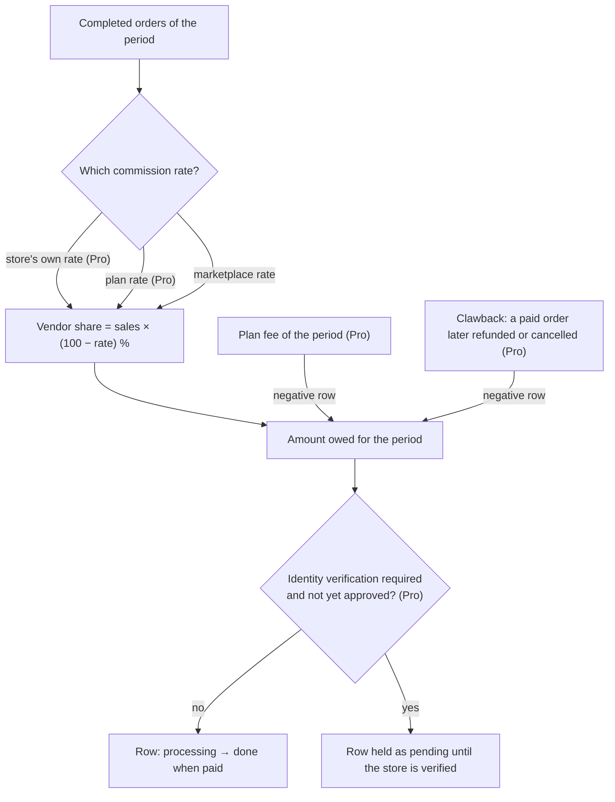
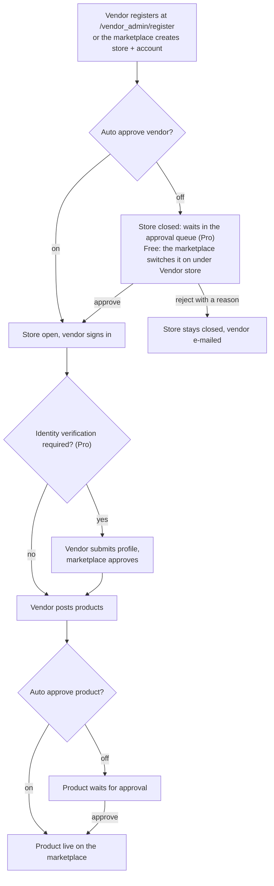
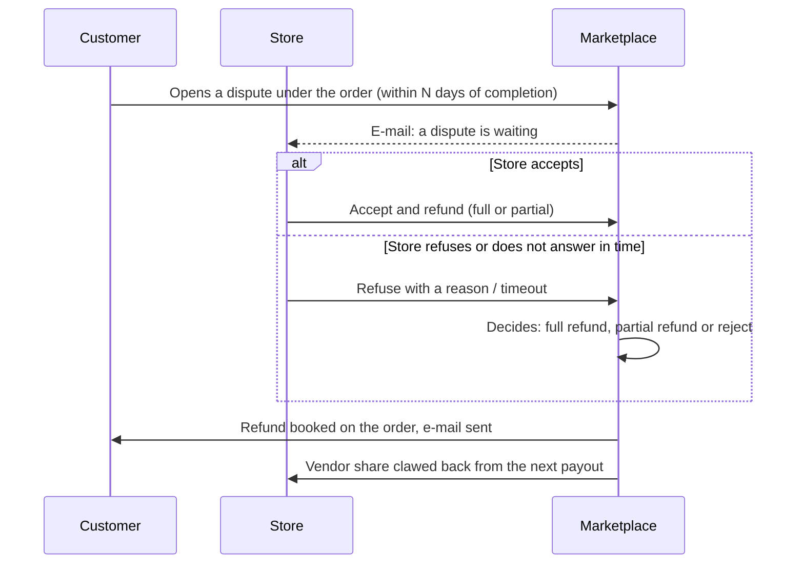

> 🌐 **Language:** [🇻🇳 Tiếng Việt](./multi-vendor-detail_vi.md) · 🇬🇧 English (current)

# MultiVendor — Detailed guide

## Introduction
This document describes **exactly what the MultiVendor plugin does today**: the marketplace operating model, features for each role (customer, vendor, marketplace owner), marketplace settings, the vendor payout process, and the rules to know before acting. It is for marketplace owners and operators; after reading you know how the marketplace runs and what to configure before opening it to vendors. Installation is covered separately in the [Installation guide](./how_to_setup.md).

## Operating model: one marketplace, one domain
1. **One storefront for every vendor.** Products of all vendors appear on the marketplace website. Each vendor has a store page at `/shop/{code}` (`code` is the store code set at creation), showing the store's product list and its own categories.
2. **Cart grouped by store.** A shopper adds products from several vendors to one cart; at checkout the system splits it into **one order per vendor** (each order carries that vendor's `store_id`).
3. **The marketplace collects payment.** Only the owner configures payment gateways. Vendors never enter payment keys and never collect money themselves.
4. **The marketplace pays vendors by commission.** Periodically the owner runs "process payouts": the system gathers each vendor's **completed** orders, keeps the commission rate and records the amount owed (see Vendor payout process).
5. **Currency and language follow the marketplace.** Stores share the marketplace currency/language; vendors cannot change them.

Key paths (defaults, changeable in `.env` — see the Installation guide):
| Role | Path |
| --- | --- |
| Store directory (search by name, product count, rating) | `/shop` |
| Store page (customers) | `/shop/{code}` — header (cover, logo, name, product count, rating, member since, contact) + tabs **Products** / **Reviews** / **About** (`?tab=`) |
| Bulk quick order per store | `/shop/{code}/quick-order` (when "Quick order" is enabled) |
| Vendor admin area | `/vendor_admin` |
| Marketplace admin (root) | the S-Cart admin area, menu **Marketplace** — Vendor store · Vendor user · Quick Configuration · Payment, plus the Pro screens Reports · Commission report · Approval queue · Complaints · Shop plans |

## Key workflows
Four flows carry the money and the trust of the marketplace. The diagrams show what the system does at each step; items marked *Pro* need the MultiVendorPro edition.

**1. From a shopper's cart to the vendor's payout**

```mermaid
flowchart LR
    A["Customer puts products of<br>several stores in one cart"] --> B["Checkout: one order per store,<br>the marketplace collects the payment"]
    B --> C["Store confirms and ships<br>within the scope the marketplace allows"]
    C --> D["Order Completed<br>(completion date stamped)"]
    D --> E["Marketplace runs payout processing<br>for a date"]
    E --> F["One ledger row per store and currency:<br>sales, commission kept, amount owed"]
    F --> G["Marketplace transfers the money<br>and marks the row done"]
    G --> H["Store sees it in Payout history<br>and receives an e-mail"]
```



**2. How the amount owed to a store is built**



**3. Bringing a vendor on board**



**4. A customer disputes an order (Pro)**



## Features by role

### Customers
- Browse and buy products of every vendor on one website; a **store directory** at `/shop`; every store has its own **Shopee-style page**: brand header, the store's banners, a **Products** tab (in-store search, category filter, sort), a **Reviews** tab (reviews of everything that store sells — needs the *Product Rating & Review* plugin enabled for the store) and an **About** tab.
- Cart, wishlist, compare, order history — the full S-Cart customer feature set.
- **B2B quick order** for one store (Pro, when enabled): search by SKU/name or store category, enter quantities for many products at once, **paste a "SKU, quantity" list**, **re-order from your previous orders** at this store (when signed in), **export a quote (Excel)**; every line is checked (minimum quantity, stock per the store's settings, right store, on sale) before anything is added to the cart.

### Vendors
- Sign in to a dedicated admin area at `/vendor_admin` (vendor accounts are separate from marketplace admin accounts).
- **Dashboard**: order, product and customer counts; 30-day and monthly order charts.
- **Products**: create/edit products with the full S-Cart admin builder (single, group, variants); products belong to the vendor's store.
- Own **store categories**, **banners** and **suppliers**.
- **Orders**: view the store's orders (filter by keyword, status, date); update the **shipping status**; **confirm orders** (New/Hold → Processing) within the scope the marketplace allows; enter **carrier + tracking code**; **print a packing slip**. Every change is written to the order history.
- **Store info**: name, description, logo, address, contact.
- **Store plugins** (Pro): switch on/off for their own store and **configure the parameters** (e.g. shipping fee, free-shipping threshold) of the plugins the marketplace opened to vendors (allowlist); unchanged values follow the marketplace defaults.
- **Payout history**: lifetime sales, paid, remaining; per-period details with where the money was sent and the transaction reference; **export a statement** (Excel) for a date range.
- **Payout account**: method (bank transfer / PayPal / other), bank, account holder, account number (encrypted at rest, only the last digits shown), note.
- **E-mail notifications** when a new order arrives for the store, when the store is approved and when the marketplace pays out a period.
- Self-registration at `/vendor_admin/register` **if** the marketplace allows it.

### Marketplace owner (root admin)
- Create/edit vendor **stores** (code, name, description, open/closed status) and **vendor accounts** (email, password, store, status).
- Allow or block vendor self-registration; choose auto- or manual approval of **new vendors** and of **new/edited products**.
- **Approval queue screen**: two tabs — vendors waiting and products waiting; Approve or Reject with a mandatory reason; decisions are logged and e-mailed to the vendor; a "last rejection" column when an item comes back.
- Configure the marketplace-wide **commission rate** and a **per-store rate** (empty = marketplace rate); the store list shows the rate in effect.
- **Vendor plans** (Pro): product cap, plan commission, period fee netted into payouts, default plan on expiry, manual renewal; see Conditions.
- **Disputes / refund requests through the marketplace** (Pro): opened from the order page, vendor answers first, marketplace decides last; refunds are booked on the order ledger and the vendor's share is clawed back automatically; see Conditions.
- **Vendor identity verification (KYC)** (Pro): encrypted text profile, approve/reject with reason in the moderation queue, verified badge; the *Require KYC* flag blocks products from going live and holds payouts of unverified stores; see Conditions.
- **Clawback after payout** (Pro): every payout period records which orders it paid; an order refunded/canceled afterwards automatically books a negative adjustment, netted into the next period; see Conditions.
- **Process payouts** per period and manage the vendor payout ledger (status, pay date, transaction reference, notes); the ledger records where the vendor wanted to be paid when the period was closed and who marked it paid; **export a statement** (Excel) per store / date range.
- **Reports**: filter by date/store/status, chart of stores by order count, Excel export.
- **Commission report per store, per period** (Pro): pick a period (this month / last month / quarter / year / custom) and a basis (**completed orders** — matches the payout ledger, or **placed orders** — revenue); per store × currency: orders, gross sales, effective commission rate, what the marketplace keeps, owed to the vendor, **paid** (payout ledger) and **outstanding**; pick one store for a month-by-month view; Excel export.
- **Open plugins to vendors** (Pro, allowlist): in Quick configuration tick each "Vendors may configure: …" flag — only installed plugins with per-store scope that are **not payment gateways** are offered; nothing is open by default.
- **E-mail notifications** when a new vendor or a vendor product waits for approval; each marketplace e-mail can be switched on/off in Quick configuration.
- Full control over every vendor's products and orders through the S-Cart admin.

### System
- Inherits all of S-Cart: multi-language, multi-currency, API, admin permissions, news, plugin library.
- Vendor and root admin areas run on the GP247 v2 **Livewire + TailAdmin** stack (no jQuery).
- Updates delivered through the GP247 extension library.

## Marketplace settings
Go to the admin area → **Marketplace** → **Quick configuration**.

These are **all** the marketplace-level settings. The *Key* column is the technical name stored in the settings table — you never need it while clicking through the screens; it is here so you can quote it when asking for technical help.

| Setting | Key | Meaning | Default | Edition |
| --- | --- | --- | --- | --- |
| Commission rate (%) | `MultiVendor_commission` | Percentage the marketplace **keeps** from completed order totals before paying the vendor. A **per-store rate** can be set on the store config screen (Marketplace → Stores → Config); empty = marketplace rate | 0 | Free |
| Allow vendor registration | `MultiVendor_allow_register` | On: anyone can self-register at `/vendor_admin/register`. Off: only the admin creates accounts | Off | Free |
| Auto approve vendor | `MultiVendor_vendor_auto_approve` | Off: a new store stays **pending** (closed) until the admin opens it | Off | Free |
| Auto approve product | `MultiVendor_product_auto_approve` | Off: products a vendor creates **or edits** wait for admin approval before showing on the marketplace | Off | Free |
| Quick order | `MultiVendor_quick_order` | Enables the bulk-order page per store | Off | Pro |
| Email vendor on new order | `MultiVendor_mail_order_created` | Sends every active vendor account of the store an e-mail when an order for that store is created | On | Free |
| Email admin on pending review | `MultiVendor_mail_pending_review` | Sends the marketplace e-mail when a new vendor or a vendor product waits for approval | On | Pro |
| Email vendor when approved | `MultiVendor_mail_vendor_approved` | Sent when the admin opens the store | On | Pro |
| Email vendor when payout is done | `MultiVendor_mail_payout_done` | Sent when a payout period is marked paid | On | Pro |
| Email vendor on payout adjustment | `MultiVendor_mail_payout_clawback` | Sent when a paid order is later refunded/cancelled and the vendor's share is clawed back in the next period | On | Pro |
| Email on disputes | `MultiVendor_mail_dispute` | Sent to the store + the marketplace when a customer opens a dispute, and to both sides on the decision | On | Pro |
| Vendor order actions | `MultiVendor_vendor_order_scope` | **Shipping status only** · **Confirm + shipping**: adds New/Hold → Processing · **Confirm + shipping + complete**: adds Processing → Done (the order enters the next payout period) | Confirm + shipping | Pro (Free always stays at *Confirm + shipping*) |
| Require vendor identity verification (KYC) | `MultiVendor_kyc_required` | On: an unverified store **cannot put products on the marketplace** and its payout rows are held at *pending* | Off | Pro |
| Dispute window (days after the order finished) | `MultiVendor_dispute_window_days` | A customer can only open a dispute within this many days of the order completing | 14 | Pro |
| Days the vendor has to answer | `MultiVendor_dispute_vendor_days` | Past this deadline without an answer, the dispute escalates to the marketplace | 3 | Pro |

Marketplace e-mails go through S-Cart's shared e-mail settings: when the system **e-mail mode** is off, nothing is sent even if the flags above are on.

Besides the table, Quick Configuration also lists **"Vendors may configure: …"** — one line per plugin the marketplace lets stores adjust themselves (see the next section).

**Free / Pro editions**: the full comparison is in the [README](./README.md#free-vs-pro). On Free, Quick Configuration shows every Pro-only switch **locked**, with the feature it belongs to and a link to its explanation page; the Pro screens stay in the menu and open an explanation page until `MultiVendorPro` is installed on top.

## Per-store settings
Not everything is set marketplace-wide. These are the settings that belong to **one store**, and who sets them.

| Setting | Where | Who sets it | Notes |
| --- | --- | --- | --- |
| Store status (open/closed) | Marketplace → Vendor stores | Marketplace owner | Closed means the vendor cannot sign in and the store page is hidden |
| Store profile (name, description, logo, cover, address, contact) | Vendor area → Store information | Vendor | Shown on the store page and in the directory |
| Per-store commission (%) | Marketplace → Stores → Config | Marketplace owner | Empty = marketplace rate; wins over the plan's rate too |
| Store plan | Marketplace → Stores → Config (plans live under *Shop plans*) | Marketplace owner (Pro) | Product cap, plan commission rate, period fee offset against the payout |
| Plugins the store may configure | Marketplace ticks them in **Quick configuration**, the vendor adjusts them in Vendor area → Store plugins | Marketplace opens, vendor adjusts (Pro) | Payment gateways are never opened |
| Payout account (bank, account holder, account number) | Vendor area → Payout history | Vendor (Pro) | The account number is stored encrypted, only the last digits are shown |
| Dealer price groups and their discount | Vendor area → Price groups | Vendor (Pro) | Applies to that store's customers and is never shown publicly |
| Banners and the store's own categories | Vendor area → Banner / Categories | Vendor | Scoped to that store only |

## Customisation
Three levels, easiest first: paths and wording (no coding), the store page layout (one blade file), and deeper customisation for developers.

### Changing the paths
The plugin's four paths live in `.env`; the details and the warnings are in the [Setup guide](./how_to_setup.md#custom-paths-optional). Remember two things: **the old paths start returning 404** (set up 301 redirects on a live site), and **do not collide** with the admin prefix or an existing page/product slug.

### Changing wording and e-mail content
Every string the plugin shows — screen labels, messages, **e-mail subjects and bodies** — is a **language row in the database**, editable in the admin area, with **no file to edit**:

1. Go to **Localisation → Language manager** (`/gp247_admin/language_manager`).
2. Filter **Group** = `multi_vendor`, pick the language, search by code or by the text you see on screen.
3. Edit and save — it takes effect immediately and **survives plugin updates**.

Code convention: `multi_vendor.mail.*` is e-mail content (for example `multi_vendor.mail.vendor_approved.subject`), `multi_vendor.pro.*` is the wording of the Pro explanation pages, everything else is screen labels. To get a default back, delete that row and **open the Quick configuration screen again** — the plugin re-seeds the original string.

> ⚠️ Do not edit the files under `app/GP247/Plugins/MultiVendor/Lang/` — they only cover install-time messages and **are overwritten when the plugin is updated**.

### Changing the store page layout
The "New stores" block (`vendor_new.blade.php`) is copied into the `blocks/` folder of the active template when the plugin is installed — edit it there to change how the block looks on the home page, and add or remove it through **Layout blocks** in the admin area.

The other store pages can be **replaced with your own** without touching the plugin: create a file of the same name inside the active template at

```
app/GP247/Templates/<TemplateName>/Plugins/MultiVendor/<view-name>.blade.php
```

The template file wins; the plugin's own file is used only when it does not exist. Views you can replace:

| View | Page |
| --- | --- |
| `vendor_index` | The store directory `/shop` |
| `vendor_home` | A store page `/shop/{code}` |
| `vendor_info` | The store's **Information** tab |
| `vendor_product_list` | The product grid inside a store page |
| `hooks.order_dispute_box` | The dispute box under the customer's order page (Pro) |

### Permissions for marketplace staff
The Marketplace screens sit in S-Cart's own permission system: **User permission → Roles / Permission**, granted by **screen path** (for example `MultiVendor/store`, `MultiVendor/payment`). A staff member without the permission does not see the menu item. Vendor accounts do **not** use this system — they sign in to their own area and are always confined to their store.

### For developers
- **Never edit files inside the plugin folder.** Anything changed in `app/GP247/Plugins/MultiVendor/` is lost on update. Use the three supported routes: language rows (above), template views (above), and the extension points below.
- **Customer order page hook**: the plugin registers its dispute box in `gp247-config.front.plugin_hooks` at `shop_order_detail_bottom`. Other plugins use the same mechanism to add their own content without editing the template.
- **Product price**: per-store dealer pricing (Pro) plugs into the `gp247-config.shop.price_resolvers` seam of `gp247/shop`, so the cart, the checkout, quick order and the quote sheet all agree on one price. Another pricing plugin registers a resolver the same way.
- **Store URLs in code**: use the plugin's helper instead of building `/shop/...` by hand, so an `.env` change moves every link with it.
- **Updating safely**: the plugin converges on every entry point — fresh install, reinstall and update (menu, language rows, tables) — and repairs its menu block when the Quick configuration screen is opened. After replacing files by hand, run `php artisan gp247:cache-rebuild` and open **Quick configuration** once.

## Vendor payout process
1. **The order must be Completed.** When the marketplace admin moves an order to Completed, the system stamps its completion date. Moving it back clears the date.
2. **The admin runs processing.** Go to **Marketplace** → **Payment**, enter the **processing date** and run.
3. **The system gathers and records.** Every completed order whose completion date is ≤ the processing date (and after the previously processed period) is grouped **by store and by currency**. For each group the system takes **that store's commission rate** (its own rate if set, otherwise the marketplace rate) and creates one ledger row: order count, total sales, vendor share (= 100 − commission), **amount owed** = total sales × vendor share **rounded to the currency's decimals** (VND none, USD 2), the payout account the vendor declared, initial status `processing`.
4. **The admin pays and marks it.** After transferring money to the vendor outside the system using the payout details on the row, the admin edits the row: status `done`, **transaction reference**, note; the system records the pay date and who marked it. The vendor gets an e-mail and sees the result under **Payout history**.

Example: commission 10%, vendor A has 3 completed orders totalling 5,000,000 VND in the period → ledger row: 3 orders, total 5,000,000, vendor share 90%, amount owed 4,500,000 VND.

## Conditions & Rules (know before you act)

**When installing**
- **MultiVendor (and MultiVendorPro) cannot be installed while MultiStore / MultiStorePro is installed** — two different business models share the store table with different meanings; the installer stops at once and writes nothing. Uninstall the multi-store plugin first (MultiStore refuses the other way round as well).

**When creating a vendor / store**
- **The store code is unique, at most 20 characters** — it becomes the path `/shop/{code}`; a duplicate would be ambiguous.
- **Each vendor account belongs to exactly one store** — permissions and data (orders, products) are scoped to that store.
- **A locked vendor account or a closed store cannot enter the vendor area** — the system redirects to an "account inactive" page; the admin must reopen it.

**When a vendor posts products**
- **With "Auto approve product" off, products are always saved unapproved**, even if the vendor ticks "approve" — the owner keeps the final say.
- **A rejected product stays unapproved**; the vendor edits and saves to resubmit — the previous rejection reason is shown to the admin.

**When a customer uses quick order (B2B)**
- **Nothing is added to the cart until every line is valid** — each rejected line is reported by SKU with the reason; dealers need the exact list, not a partial cart.
- **Quantities must be whole numbers ≥ 1 and not below the product's "minimum quantity"** — the minimum is set by the vendor on the product.
- **Never above stock when the store manages stock and "sell when out of stock" is off** — the same rule as S-Cart's regular cart.
- **Only products of that very store** — a SKU of another store is reported as "not sold by this store".
- **Re-order only from your own orders at that store** (sign-in required); lines no longer sold are reported as skipped.
- **Prices are the store's current selling prices** — a signed-in customer who belongs to one of the store's price groups (Pro) sees the group price.

**When a vendor configures store plugins (Pro)**
- **Only plugins the marketplace ticked open** appear in the vendor area; payment plugins are never offered — the marketplace collects the money, vendors never enter payment keys.
- **Every change applies to the vendor's own store only** — the marketplace and other stores are untouched; unchanged values inherit the marketplace default and a "Reset to default" action brings them back.
- **Marketplace secrets are never shown in the vendor area** — an empty password/key field means the shared value is in use.

**When the marketplace uses vendor plans (Pro)**
- The marketplace defines **plans** under *Vendor plans*: product cap (empty = unlimited), a plan commission (empty = marketplace rate; a per-store override still wins), a period fee (month/year) and **one default plan**.
- The marketplace **assigns a plan** on the store configuration screen: a new period starts now and **the plan fee is booked as a negative row in the payout ledger**, **netted into the store's next payout** (no separate collection).
- **Periods do not renew by themselves**: when a period ends the store falls back to the default plan until the marketplace clicks *Renew* (new period, new fee). Vendors see their plan, products used / cap, fee and expiry on the dashboard.
- At the product cap a vendor **cannot add new products** (editing existing ones still works).

**When a customer disputes an order / asks for a refund (Pro)**
- A signed-in customer opens a dispute **right under their order page** (problem type, description ≥ 10 characters, optional requested amount) — only on orders from marketplace vendors that are not canceled/refunded, were paid or completed, and are **within N days** after completion (setting, default 14). One live dispute per order; the customer may withdraw while the vendor has not answered.
- **The vendor answers first** within N days (default 3): *Accept & refund* (full or partial, never above the refundable balance) or *Refuse* with a reason ⇒ escalated to the marketplace. No answer in time ⇒ escalated automatically (checked when screens load — no cron).
- **The marketplace decides last** under the *Disputes* menu: full refund / partial refund / reject (note required).
- **A refund decision is booked on the order ledger immediately** (refund transaction; a full refund moves the order to *Refunded*) and **the vendor's share is clawed back** from the next payout (see clawback). Returning the money to the customer is done by the marketplace through the original payment method — outside the system, like vendor payouts.
- E-mail: vendor + marketplace when a dispute opens; customer when the vendor refuses; customer + vendor on the decision (flag in Quick configuration).

**When the marketplace turns on "Require identity verification (KYC)" (Pro)**
- A vendor submits a **text identity profile** (individual / company: legal name, tax id or ID number — stored **encrypted**, representative, address, note) under *Identity verification*; no document upload is needed.
- The marketplace reviews it on the **Verification** tab of the moderation queue; a rejection needs a reason (≥ 5 characters) and the vendor may resubmit.
- **Until approved**: the store's products **cannot be approved to go live** (even with product auto-approve on) and its payout rows are held as **pending** (money booked, not paid) — the marketplace releases them after verification.
- An approved store carries the **"Verified" badge** on its shop page, in the directory and in the marketplace's store list. Flag off ⇒ nothing is blocked, the badge still shows.

**When an order already paid out to a vendor is refunded / canceled (Pro)**
- **No money is pulled back** — the system books a negative **clawback** row in the store's payout ledger for exactly the vendor share paid for that order (at the paid period's rate, not today's); it is **netted into the next payout period**.
- **Partial refunds** adjust the vendor share of the refunded amount; a later full refund only claws back what is left.
- **Reopened order** → a pending clawback is canceled; an already-netted one gets a positive **reversal** row.
- Vendors get an e-mail on each adjustment (flag in Quick configuration); adjustments are visible in Payment history, the statement and the commission report.

**When reviewing**
- **A rejection needs a reason of at least 5 characters** — it is e-mailed to the vendor and logged.
- **Rejecting a vendor does not delete the store** — it stays closed; the admin can approve later or delete by hand.
- **Vendors cannot change the store's currency/language** — keeps prices and taxes consistent across the marketplace.

**When setting a store's own commission**
- **Only a number from 0 to 100 is accepted** — it is the percentage the marketplace keeps; anything else is rejected.
- **A new rate applies to payout periods processed after the change**, for every order of that period — to keep periods clean, process the current period first, then change the rate.

**When a vendor handles an order**
- **A vendor can only move an order within the scope the marketplace allows** (default: New/Hold → Processing) — so a vendor cannot push orders into a payout period or move money/stock on their own.
- **A vendor never cancels, refunds or re-opens a finalized order** — those move money and stock; only the marketplace does them.
- **Cancelled/refunded orders accept no shipment or shipping-status edits** — the order has left the vendor's hands.
- **Carrier and tracking code up to 100 characters, note up to 255** — enough for every carrier's codes.

**When processing payouts**
- **Only Completed orders count** — avoids paying for orders that can still be cancelled or refunded.
- **The processing date must be before today** — so every order of that day is final.
- **An already processed date cannot be processed again** — prevents recording the same orders twice.
- **The amount owed is rounded to the currency's decimals** (VND: whole numbers; USD: 2 decimals) — the same way S-Cart stores order money.
- **The marketplace transfers money outside the system** using the details the vendor declared — the plugin does not push money through a payout gateway.

**Installation**
- **Do not install together with MultiStore** — both plugins use the shared store mechanism under two different models; the plugin refuses to install when MultiStore is detected.

## Q&A
**Q1: Can vendors configure their own shipping fees or coupons?**

→ With Pro, yes — for the plugins the marketplace opens to vendors (shipping, promotions…); each vendor configures them for its own store only. Payment gateways are always configured centrally by the marketplace.

**Q2: I turned off "Auto approve product" — where do I approve?**

→ Marketplace → **Approval queue**, Products waiting tab: Approve or Reject with a reason. Products a vendor edits return to the queue.

**Q3: Do vendors get an email when a new order arrives?**

→ Yes: every active vendor account of the store receives an e-mail for each new order. S-Cart's **e-mail mode** and the matching flag in Quick configuration must be on.

**Q4: What can a vendor change on an order?**

→ The shipping status; confirming the order (New/Hold → Processing) within the scope set in Quick configuration; carrier and tracking code; printing a packing slip. Cancellation, refunds, re-opening and payment status are handled by the owner.

**Q5: I ran payout processing but no row appeared?**

→ Check that the orders are Completed, that their completion date is ≤ the processing date, and that the date was not processed before.

**Q6: I want a different commission for each dealer — how?**

→ Go to Marketplace → Stores → Store config and enter **Store commission (%)**. Empty means the marketplace rate. Vendors see the rate in effect on their Payout history.

**Q7: The marketplace uses several currencies — how does the ledger look?**

→ Rows are split per order currency; lifetime totals are also shown per currency.

**Q8: Do vendors get a standalone website on a domain name of their own?**

→ No. The only model is the shared marketplace on one domain; stores live at `/shop/{code}`.

**Q9: Is there sample data to try after installing?**

→ Yes, run `php artisan gp247:vendor-sample` to create 3 sample stores, each with its own vendor login, supplier, 3 categories and 9 products. The logins and the password are listed in the Installation guide; test sites only.

---

<sub>📅 **Last updated:** 2026-09-21 · ✍️ **Author:** GP247</sub>
