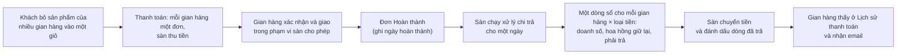
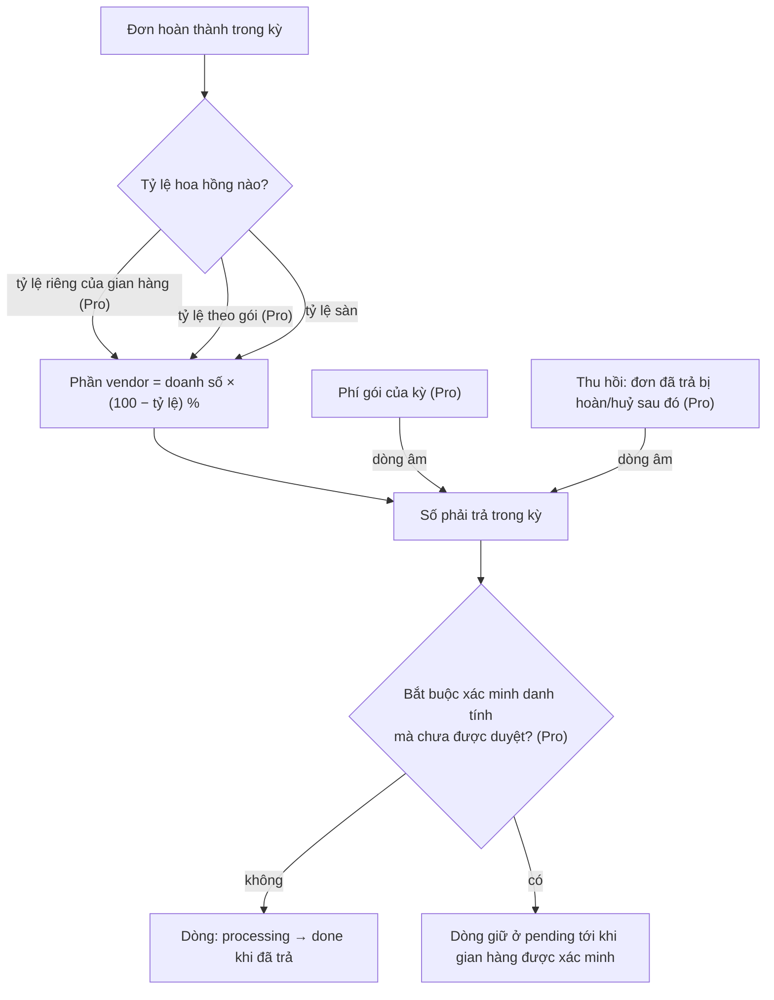
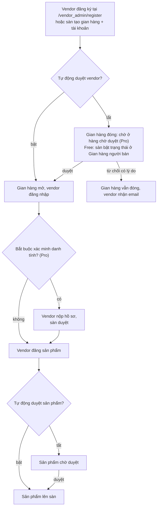
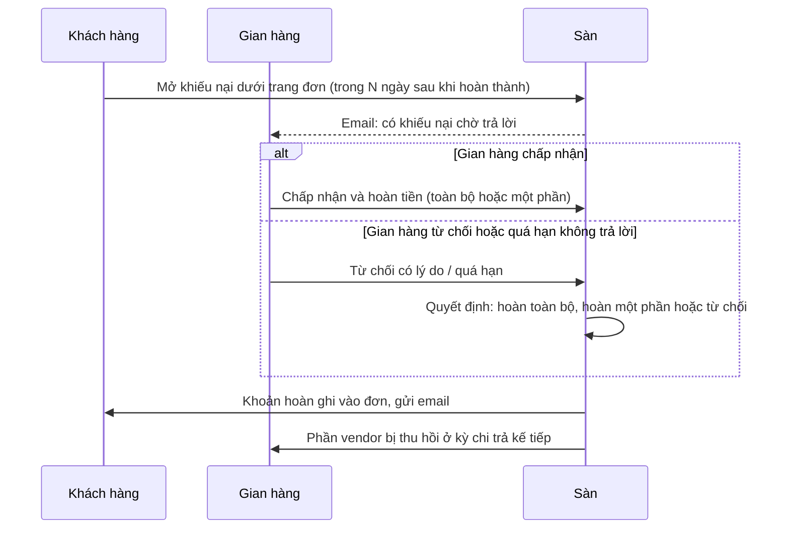

> 🌐 **Ngôn ngữ:** 🇻🇳 Tiếng Việt (hiện tại) · [🇬🇧 English](./multi-vendor-detail_en.md)

# MultiVendor — Hướng dẫn chi tiết

## Giới thiệu
Tài liệu này mô tả **đúng những gì plugin MultiVendor đang làm được**: mô hình vận hành sàn, tính năng cho từng vai (khách hàng, vendor, chủ sàn), các cấu hình của sàn, quy trình trả tiền cho vendor và các điều kiện cần biết trước khi thao tác. Dành cho chủ sàn và người vận hành; đọc xong bạn biết sàn chạy thế nào và cấu hình gì trước khi mở cho vendor. Phần cài đặt xem riêng ở [Hướng dẫn cài đặt](./how_to_setup_vi.md).

## Mô hình vận hành: sàn chung một domain
1. **Một storefront cho mọi vendor.** Sản phẩm của tất cả vendor hiện chung trên website của sàn. Mỗi vendor có trang gian hàng tại `/vendor/{code}` (`code` là mã gian hàng đặt khi tạo), gồm danh sách sản phẩm và danh mục riêng của gian hàng.
2. **Giỏ hàng nhóm theo gian hàng.** Khách bỏ sản phẩm của nhiều vendor vào một giỏ; khi thanh toán, hệ thống tách thành **mỗi vendor một đơn hàng** (mỗi đơn gắn `store_id` của vendor đó).
3. **Sàn thu tiền.** Cổng thanh toán chỉ chủ sàn cấu hình. Vendor không nhập khóa thanh toán, không tự thu.
4. **Sàn trả vendor theo hoa hồng.** Định kỳ, chủ sàn chạy "xử lý thanh toán": hệ thống gom các đơn **đã hoàn thành** của từng vendor, giữ lại tỷ lệ hoa hồng và ghi sổ số tiền phải trả (xem mục Quy trình trả tiền).
5. **Tiền tệ và ngôn ngữ theo sàn.** Gian hàng dùng chung tiền tệ/ngôn ngữ của sàn; vendor không đổi riêng.

Đường dẫn quan trọng (mặc định, đổi được qua `.env` — xem Hướng dẫn cài đặt):
| Vai | Đường dẫn |
| --- | --- |
| Danh bạ gian hàng (tìm theo tên, số sản phẩm, đánh giá) | `/vendor` |
| Trang gian hàng (khách xem) | `/vendor/{code}` — header (ảnh bìa, logo, tên, số sản phẩm, đánh giá, ngày tham gia, liên hệ) + tab **Sản phẩm** / **Đánh giá** / **Thông tin** (`?tab=`) |
| Đặt hàng nhanh theo gian hàng | `/vendor/{code}/quick-order` (khi sàn bật "Đặt hàng nhanh") |
| Khu quản trị vendor | `/vendor_admin` |
| Quản trị sàn (root admin) | khu admin của S-Cart, menu **Chợ bán hàng** — Gian hàng người bán · Tài khoản người bán · Cấu hình nhanh · Thanh toán, cùng các màn Pro Báo cáo · Báo cáo hoa hồng · Hàng chờ duyệt · Khiếu nại · Gói gian hàng |

## Các luồng chính
Bốn luồng mang tiền và niềm tin của sàn. Sơ đồ cho thấy hệ thống làm gì ở từng bước; mục ghi *Pro* cần bản MultiVendorPro.

**1. Từ giỏ hàng của khách tới tiền về tay vendor**



**2. Số tiền phải trả một gian hàng được tính thế nào**



**3. Đưa một vendor lên sàn**



**4. Khách khiếu nại một đơn (Pro)**



## Tính năng theo vai

### Khách hàng
- Duyệt và mua sản phẩm của mọi vendor trên cùng website; **danh bạ gian hàng** `/vendor`; mỗi gian hàng có **trang riêng kiểu Shopee**: header thương hiệu, banner của gian hàng, tab **Sản phẩm** (tìm trong gian hàng, lọc danh mục, sắp xếp), tab **Đánh giá** (đánh giá mọi sản phẩm gian hàng đó bán — cần plugin *Product Rating & Review* bật cho gian hàng) và tab **Thông tin**.
- Giỏ hàng, danh sách yêu thích, so sánh, lịch sử đơn — toàn bộ tính năng khách hàng của S-Cart.
- **Đặt hàng nhanh (B2B)** cho một gian hàng (bản Pro, khi sàn bật): tìm theo SKU/tên hoặc danh mục gian hàng, nhập số lượng nhiều sản phẩm một lần, **dán danh sách "SKU, số lượng"**, **đặt lại theo đơn cũ** của mình tại gian hàng (khi đã đăng nhập), **xuất báo giá Excel**; hệ thống kiểm tra từng dòng (số lượng tối thiểu, tồn kho theo cài đặt gian hàng, sản phẩm đúng gian hàng và đang bán) trước khi thêm vào giỏ.

### Nhà cung cấp (vendor)
- Đăng nhập khu quản trị riêng `/vendor_admin` (tài khoản vendor tách khỏi tài khoản admin sàn).
- **Dashboard**: số đơn, số sản phẩm, số khách; biểu đồ đơn 30 ngày và theo tháng.
- **Sản phẩm**: tạo/sửa sản phẩm đầy đủ như admin S-Cart (đơn, nhóm, biến thể); sản phẩm thuộc gian hàng của mình.
- **Danh mục gian hàng**, **banner**, **nhà cung cấp** riêng.
- **Đơn hàng**: xem đơn của gian hàng mình (lọc theo từ khóa, trạng thái, ngày); cập nhật **trạng thái giao hàng**; **xác nhận đơn** (Mới/Giữ → Đang xử lý) theo phạm vi sàn cho phép; nhập **hãng vận chuyển + mã vận đơn**; **in phiếu giao**. Mọi thay đổi ghi vào lịch sử đơn.
- **Thông tin gian hàng**: tên, mô tả, logo, địa chỉ, liên hệ.
- **Plugin của gian hàng** (Pro): bật/tắt cho gian hàng mình và **tự cấu hình** tham số (ví dụ phí vận chuyển, ngưỡng miễn phí ship) của các plugin sàn đã mở cho vendor; giá trị không đổi thì theo mặc định của sàn.
- **Lịch sử thanh toán**: tổng bán lũy kế, đã nhận, còn lại; chi tiết từng kỳ kèm nơi chuyển tiền và mã giao dịch; **xuất bảng kê** (Excel) theo khoảng ngày.
- **Thông tin nhận tiền**: khai phương thức (chuyển khoản / PayPal / khác), ngân hàng, tên chủ tài khoản, số tài khoản (được mã hoá khi lưu, chỉ hiện vài số cuối), ghi chú.
- **Nhận email** khi có đơn mới cho gian hàng, khi gian hàng được duyệt và khi sàn đã trả tiền một kỳ.
- Tự đăng ký tài khoản tại `/vendor_admin/register` **nếu** sàn cho phép.

### Chủ sàn (root admin)
- Tạo/sửa **gian hàng** vendor (mã, tên, mô tả, trạng thái mở/đóng) và **tài khoản vendor** (email, mật khẩu, gắn gian hàng, trạng thái).
- Bật/tắt cho vendor tự đăng ký; chọn tự duyệt hay phải duyệt **vendor mới** và **sản phẩm mới/sửa**.
- **Màn Hàng chờ duyệt**: hai tab vendor chờ duyệt và sản phẩm chờ duyệt; Duyệt hoặc Từ chối kèm lý do (bắt buộc); quyết định được ghi sổ và gửi email cho vendor; cột "lần từ chối gần nhất" khi mục quay lại hàng chờ.
- Cấu hình **tỷ lệ hoa hồng** toàn sàn và **tỷ lệ riêng cho từng gian hàng** (để trống = theo sàn); danh sách gian hàng hiện tỷ lệ đang áp dụng.
- **Gói vendor** (Pro): giới hạn sản phẩm, hoa hồng theo gói, phí kỳ trừ vào payout, gói mặc định khi hết kỳ, sàn gia hạn tay; xem mục Điều kiện.
- **Khiếu nại / yêu cầu hoàn tiền qua sàn** (Pro): khách mở từ trang đơn, người bán phản hồi trước, sàn quyết cuối; hoàn tiền ghi thẳng vào sổ đơn và tự thu hồi phần người bán; xem mục Điều kiện.
- **Xác minh danh tính vendor (KYC)** (Pro): hồ sơ văn bản mã hoá, duyệt/từ chối có lý do trong hàng chờ kiểm duyệt, huy hiệu đã xác minh; cờ *Bắt buộc KYC* chặn sản phẩm lên sàn và giữ thanh toán của gian hàng chưa xác minh; xem mục Điều kiện.
- **Thu hồi sau thanh toán (clawback)** (Pro): mỗi kỳ thanh toán ghi lại đơn nào đã trả; đơn bị hoàn/hủy sau đó tự tạo dòng điều chỉnh âm, bù trừ ở kỳ kế tiếp; xem mục Điều kiện.
- **Xử lý thanh toán** theo kỳ và quản lý sổ trả tiền vendor (trạng thái, ngày trả, mã giao dịch, ghi chú); sổ ghi nơi vendor muốn nhận tiền tại thời điểm chốt kỳ và ai đã đánh dấu đã trả; **xuất bảng kê** Excel theo gian hàng/khoảng ngày.
- **Báo cáo**: lọc theo ngày/gian hàng/trạng thái, biểu đồ gian hàng theo số đơn, xuất Excel.
- **Báo cáo hoa hồng theo gian hàng, theo kỳ** (Pro): chọn kỳ (tháng này / tháng trước / quý / năm / tuỳ chọn) và cơ sở tính (**đơn hoàn tất** — khớp sổ thanh toán, hoặc **đơn đã đặt** — doanh thu); mỗi gian hàng × loại tiền: số đơn, doanh số, tỷ lệ hoa hồng đang áp, phần sàn giữ, phải trả vendor, **đã trả** (theo sổ thanh toán) và **còn lại**; chọn một gian hàng để xem theo tháng; xuất Excel.
- **Mở plugin cho vendor** (Pro): trong Cấu hình nhanh tick từng plugin "Vendor tự cấu hình: …" — chỉ plugin cài trên sàn có phạm vi theo gian hàng và **không phải cổng thanh toán** mới xuất hiện; mặc định không mở plugin nào.
- **Nhận email** khi có vendor mới hoặc sản phẩm vendor chờ duyệt; bật/tắt từng loại email sàn ở Cấu hình nhanh.
- Toàn quyền trên sản phẩm, đơn hàng của mọi vendor qua khu admin S-Cart.

### Hệ thống
- Kế thừa toàn bộ S-Cart: đa ngôn ngữ, đa tiền tệ, API, phân quyền admin, tin tức, thư viện plugin.
- Khu quản trị vendor và root dùng chung nền **Livewire + TailAdmin** của GP247 v2 (không jQuery).
- Tự động cập nhật qua thư viện mở rộng GP247.

## Cấu hình sàn
Vào khu admin → **Chợ bán hàng** → **Cấu hình nhanh**.

Đây là **toàn bộ** cấu hình cấp sàn. Cột *Khoá* là tên kỹ thuật lưu trong bảng cấu hình — bạn không cần dùng tới khi thao tác trên giao diện, nó có ở đây để tra cứu khi cần hỗ trợ kỹ thuật.

| Cấu hình | Khoá | Ý nghĩa | Mặc định | Bản |
| --- | --- | --- | --- | --- |
| Tỷ lệ hoa hồng (%) | `MultiVendor_commission` | Phần trăm sàn **giữ lại** trên tổng đơn đã hoàn thành trước khi trả vendor. Có thể đặt **tỷ lệ riêng cho từng gian hàng** ở màn cấu hình gian hàng (Chợ bán hàng → Gian hàng → Cấu hình); để trống = theo sàn | 0 | Free |
| Cho phép đăng ký vendor | `MultiVendor_allow_register` | Bật: ai cũng có thể tự đăng ký tại `/vendor_admin/register`. Tắt: chỉ admin tạo tài khoản | Tắt | Free |
| Tự động duyệt vendor | `MultiVendor_vendor_auto_approve` | Tắt: gian hàng mới ở trạng thái **chờ duyệt** (đóng) cho tới khi admin mở | Tắt | Free |
| Tự động duyệt sản phẩm | `MultiVendor_product_auto_approve` | Tắt: sản phẩm vendor tạo **hoặc sửa** đều chờ admin duyệt mới hiện lên sàn | Tắt | Free |
| Đặt hàng nhanh | `MultiVendor_quick_order` | Bật trang đặt hàng số lượng lớn theo gian hàng | Tắt | Pro |
| Email cho vendor khi có đơn mới | `MultiVendor_mail_order_created` | Gửi mọi tài khoản vendor đang hoạt động của gian hàng khi có đơn thuộc gian hàng đó | Bật | Free |
| Email cho admin khi có mục chờ duyệt | `MultiVendor_mail_pending_review` | Gửi email của sàn khi có vendor mới hoặc sản phẩm vendor chờ duyệt | Bật | Pro |
| Email cho vendor khi được duyệt | `MultiVendor_mail_vendor_approved` | Gửi khi admin mở gian hàng | Bật | Pro |
| Email cho vendor khi đã trả tiền | `MultiVendor_mail_payout_done` | Gửi khi một kỳ thanh toán được đánh dấu đã trả | Bật | Pro |
| Email cho vendor khi có điều chỉnh thanh toán | `MultiVendor_mail_payout_clawback` | Gửi khi một đơn đã trả bị hoàn/huỷ và phần vendor bị thu hồi ở kỳ kế tiếp | Bật | Pro |
| Email khi có khiếu nại | `MultiVendor_mail_dispute` | Gửi cho gian hàng + sàn khi khách mở khiếu nại, và cho các bên khi có quyết định | Bật | Pro |
| Vendor được làm gì với đơn | `MultiVendor_vendor_order_scope` | **Chỉ giao hàng**: vendor chỉ đổi trạng thái giao hàng · **Xác nhận + giao hàng**: thêm Mới/Giữ → Đang xử lý · **Xác nhận + giao hàng + hoàn tất**: thêm Đang xử lý → Hoàn thành (đơn vào kỳ thanh toán kế tiếp) | Xác nhận + giao hàng | Pro (Free luôn ở mức *Xác nhận + giao hàng*) |
| Bắt buộc xác minh danh tính vendor (KYC) | `MultiVendor_kyc_required` | Bật: gian hàng chưa được xác minh **không đưa được sản phẩm lên sàn** và dòng thanh toán bị giữ ở *pending* | Tắt | Pro |
| Cửa sổ khiếu nại (số ngày sau khi đơn hoàn tất) | `MultiVendor_dispute_window_days` | Khách chỉ mở được khiếu nại trong khoảng ngày này kể từ khi đơn hoàn tất | 14 | Pro |
| Số ngày vendor phải phản hồi | `MultiVendor_dispute_vendor_days` | Quá hạn này mà gian hàng chưa trả lời, khiếu nại tự chuyển lên sàn | 3 | Pro |

Email sàn đi qua cấu hình email chung của S-Cart: nếu **Chế độ gửi email** của hệ thống đang tắt thì không email nào được gửi, kể cả khi các cờ trên bật.

Ngoài bảng trên, Cấu hình nhanh còn hiện mục **"Vendor tự cấu hình: …"** — một dòng cho mỗi plugin sàn cho phép gian hàng tự chỉnh (xem mục kế tiếp).

**Phiên bản Free / Pro**: bảng so sánh đầy đủ ở [README](./README_vi.md#so-sánh-free-và-pro). Trên Free, Cấu hình nhanh hiện mọi công tắc chỉ-Pro ở trạng thái **khoá**, ghi rõ tính năng tương ứng và có link tới trang giải thích; các màn Pro vẫn nằm trong menu và mở trang giải thích cho tới khi cài thêm `MultiVendorPro`.

## Cấu hình theo từng gian hàng
Không phải cấu hình nào cũng đặt ở cấp sàn. Bảng dưới là những thứ đặt **riêng cho một gian hàng**, và ai là người đặt.

| Cấu hình | Đặt ở đâu | Ai đặt | Ghi chú |
| --- | --- | --- | --- |
| Trạng thái gian hàng (mở/đóng) | Chợ bán hàng → Gian hàng người bán | Chủ sàn | Đóng thì vendor không đăng nhập được, trang gian hàng không hiện |
| Thông tin gian hàng (tên, mô tả, logo, ảnh bìa, địa chỉ, liên hệ) | Khu vendor → Thông tin gian hàng | Vendor | Hiện trên trang gian hàng và danh bạ |
| Hoa hồng riêng (%) | Chợ bán hàng → Gian hàng → Cấu hình | Chủ sàn | Để trống = theo tỷ lệ sàn; ưu tiên cao hơn cả hoa hồng của gói |
| Gói gian hàng | Chợ bán hàng → Gian hàng → Cấu hình (gói tạo ở *Gói gian hàng*) | Chủ sàn (Pro) | Trần sản phẩm, hoa hồng theo gói, phí kỳ trừ vào payout |
| Plugin gian hàng được tự cấu hình | Sàn tick ở **Cấu hình nhanh**, vendor chỉnh ở khu vendor → Plugin của gian hàng | Chủ sàn mở, vendor chỉnh (Pro) | Không bao giờ mở cổng thanh toán |
| Thông tin nhận tiền (ngân hàng, chủ tài khoản, số tài khoản) | Khu vendor → Lịch sử thanh toán | Vendor (Pro) | Số tài khoản mã hoá khi lưu, chỉ hiện vài số cuối |
| Nhóm giá đại lý và mức chiết khấu | Khu vendor → Nhóm giá | Vendor (Pro) | Áp cho khách của gian hàng đó, không lộ ra ngoài |
| Banner, danh mục riêng của gian hàng | Khu vendor → Banner / Danh mục | Vendor | Chỉ hiện trong phạm vi gian hàng |

## Tùy chỉnh
Ba mức, từ dễ tới khó: đổi đường dẫn và chữ hiển thị (không cần lập trình), đổi giao diện gian hàng (sửa một file blade), và tùy biến sâu cho lập trình viên.

### Đổi đường dẫn
Bốn đường dẫn của plugin đặt trong `.env`, chi tiết và cảnh báo xem [Hướng dẫn cài đặt](./how_to_setup_vi.md#tùy-chỉnh-đường-dẫn-tùy-chọn). Nhớ hai điều: **đường dẫn cũ sẽ 404** (site đang chạy thật thì nên tạo chuyển hướng 301), và **không đặt trùng** với đường dẫn admin hay slug trang/sản phẩm sẵn có.

### Đổi chữ hiển thị và nội dung email
Mọi chữ của plugin — nhãn trên màn hình, thông báo, **tiêu đề và nội dung email** — đều là **chuỗi ngôn ngữ trong cơ sở dữ liệu**, sửa ngay trong admin, **không sửa file**:

1. Vào **Địa phương hóa → Quản lý ngôn ngữ** (`/gp247_admin/language_manager`).
2. Lọc **Nhóm** = `multi_vendor`, chọn ngôn ngữ, tìm theo mã hoặc theo chữ đang hiện.
3. Sửa và lưu — có hiệu lực ngay, và **giữ nguyên khi cập nhật plugin**.

Quy ước mã: `multi_vendor.mail.*` là nội dung email (ví dụ `multi_vendor.mail.vendor_approved.subject`), `multi_vendor.pro.*` là chữ của trang giới thiệu bản Pro, còn lại là nhãn màn hình. Muốn quay về mặc định thì xoá dòng đó rồi **mở lại màn Cấu hình nhanh** — plugin tự gieo lại chuỗi gốc.

> ⚠️ Đừng sửa các file trong `app/GP247/Plugins/MultiVendor/Lang/` — chỉ dùng cho thông báo lúc cài đặt và **sẽ bị ghi đè khi cập nhật plugin**.

### Đổi giao diện trang gian hàng
Khối "Gian hàng mới" (`vendor_new.blade.php`) được chép vào thư mục `blocks/` của template đang dùng khi cài plugin — sửa trực tiếp ở đó để đổi cách hiển thị trên trang chủ, và thêm/bớt khối qua **Khối bố cục** trong admin.

Các trang còn lại của gian hàng có thể **thay bằng bản của riêng bạn** mà không đụng vào plugin: tạo file cùng tên trong template đang dùng theo đường dẫn

```
app/GP247/Templates/<TênTemplate>/Plugins/MultiVendor/<tên-view>.blade.php
```

Hệ thống ưu tiên file của template, không có thì mới dùng file của plugin. Các view thay được:

| View | Trang |
| --- | --- |
| `vendor_index` | Danh bạ gian hàng `/vendor` |
| `vendor_home` | Trang gian hàng `/vendor/{code}` |
| `vendor_info` | Tab **Thông tin** của gian hàng |
| `vendor_product_list` | Lưới sản phẩm trong trang gian hàng |
| `hooks.order_dispute_box` | Hộp khiếu nại dưới trang đơn của khách (Pro) |

### Phân quyền cho nhân sự sàn
Các màn Chợ bán hàng nằm trong hệ phân quyền chung của S-Cart: **Quyền hạn người dùng → Nhóm quyền / Quyền hạn**, cấp quyền theo **đường dẫn màn hình** (ví dụ `MultiVendor/store`, `MultiVendor/payment`). Nhân viên không có quyền sẽ không thấy mục menu tương ứng. Tài khoản vendor **không** dùng hệ quyền này — họ đăng nhập khu riêng và luôn bị giới hạn trong gian hàng của mình.

### Dành cho lập trình viên
- **Không sửa file trong thư mục plugin.** Mọi thay đổi ở `app/GP247/Plugins/MultiVendor/` sẽ mất khi cập nhật. Dùng ba đường chính thức: chuỗi ngôn ngữ (ở trên), view của template (ở trên), và điểm cắm dưới đây.
- **Điểm cắm trang đơn của khách**: plugin gắn hộp khiếu nại vào `gp247-config.front.plugin_hooks` ở vị trí `shop_order_detail_bottom`. Plugin khác dùng đúng cơ chế này để chèn nội dung của mình, không cần sửa template.
- **Giá sản phẩm**: giá theo nhóm khách của gian hàng (Pro) cắm vào seam `gp247-config.shop.price_resolvers` của `gp247/shop`, nên giỏ hàng, thanh toán, đặt hàng nhanh và báo giá luôn thấy cùng một giá. Plugin giá khác đăng ký thêm resolver theo cùng khuôn.
- **Đường dẫn gian hàng trong code**: dùng helper của plugin thay vì tự nối chuỗi `/vendor/...`, để đổi `.env` là mọi link đổi theo.
- **Cập nhật an toàn**: plugin tự hội tụ (menu, chuỗi ngôn ngữ, bảng dữ liệu) ở mọi đường vào — cài mới, cài lại, cập nhật — và tự sửa khối menu khi mở màn Cấu hình nhanh. Sau khi thay file bằng tay, chạy `php artisan gp247:cache-rebuild` rồi mở một lần màn **Cấu hình nhanh**.

## Quy trình trả tiền cho vendor
1. **Đơn hàng phải ở trạng thái Hoàn thành.** Khi admin sàn chuyển đơn sang Hoàn thành, hệ thống ghi ngày hoàn thành cho đơn. Chuyển ngược lại sẽ xóa ngày này.
2. **Admin chạy xử lý.** Vào **Chợ bán hàng** → **Thanh toán**, nhập **ngày xử lý** rồi bấm xử lý.
3. **Hệ thống gom và ghi sổ.** Mọi đơn hoàn thành có ngày hoàn thành ≤ ngày xử lý (và sau kỳ đã xử lý trước đó) được gom **theo gian hàng và theo loại tiền**. Với mỗi nhóm, hệ thống lấy **tỷ lệ hoa hồng của gian hàng đó** (tỷ lệ riêng nếu có, không thì tỷ lệ sàn) và tạo một dòng sổ gồm: số đơn, tổng bán, tỷ lệ vendor nhận (= 100 − hoa hồng), **số tiền phải trả** = tổng bán × tỷ lệ vendor nhận **làm tròn theo số lẻ của loại tiền** (VND không lẻ, USD 2 số lẻ), nơi nhận tiền vendor đã khai, trạng thái ban đầu `processing`.
4. **Admin trả tiền và đánh dấu.** Sau khi chuyển tiền cho vendor ngoài hệ thống theo thông tin nhận tiền trên dòng sổ, admin sửa dòng sổ: trạng thái `done`, **mã giao dịch**, ghi chú; hệ thống ghi ngày trả và người đánh dấu. Vendor nhận email và thấy kết quả ở **Lịch sử thanh toán**.

Ví dụ: hoa hồng 10%, vendor A có 3 đơn hoàn thành tổng 5.000.000 VND trong kỳ → sổ ghi: 3 đơn, tổng 5.000.000, tỷ lệ nhận 90%, phải trả 4.500.000 VND.

## Điều kiện & ràng buộc (hiểu trước khi thao tác)

**Khi cài đặt**
- **Không thể cài MultiVendor (và MultiVendorPro) khi website đang cài MultiStore / MultiStorePro** — hai mô hình kinh doanh khác nhau dùng chung bảng cửa hàng với ngữ nghĩa khác nhau; trình cài dừng ngay, không ghi gì. Gỡ plugin multi-store trước rồi cài lại (chiều ngược lại MultiStore cũng chặn như vậy).

**Khi tạo vendor / gian hàng**
- **Mã gian hàng là duy nhất, tối đa 20 ký tự** — mã dùng làm đường dẫn `/vendor/{code}`, trùng sẽ không biết trỏ tới ai.
- **Mỗi tài khoản vendor gắn đúng một gian hàng** — quyền và dữ liệu (đơn, sản phẩm) phân theo gian hàng đó.
- **Tài khoản vendor bị khóa hoặc gian hàng đang đóng thì không vào được khu vendor** — hệ thống chuyển tới trang "tài khoản chưa kích hoạt"; admin cần mở lại.

**Khi vendor đăng sản phẩm**
- **Sàn tắt "Tự động duyệt sản phẩm" → sản phẩm luôn lưu ở trạng thái chưa duyệt**, kể cả vendor có tick "duyệt" — chủ sàn giữ quyền kiểm duyệt cuối.
- **Sản phẩm bị từ chối vẫn ở trạng thái chưa duyệt**; vendor sửa và lưu lại là gửi duyệt lần nữa — lý do từ chối lần trước hiện cho admin.

**Khi khách đặt hàng nhanh (B2B)**
- **Chỉ thêm vào giỏ khi mọi dòng hợp lệ** — dòng nào sai được báo theo SKU kèm lý do; đại lý cần đúng danh sách, không nhận giỏ thiếu dòng.
- **Số lượng phải là số nguyên ≥ 1 và không dưới "số lượng tối thiểu" của sản phẩm** — mức tối thiểu do vendor đặt trên sản phẩm.
- **Không vượt tồn kho khi gian hàng bật quản lý tồn và tắt "bán khi hết hàng"** — cùng quy tắc với giỏ hàng thường của S-Cart.
- **Chỉ sản phẩm của đúng gian hàng đó** — mã SKU của gian hàng khác bị báo "không có ở gian hàng này".
- **Đặt lại đơn cũ chỉ với đơn của chính bạn tại gian hàng đó** (cần đăng nhập); dòng nào không còn bán được báo bỏ qua.
- **Giá là giá bán hiện tại của gian hàng** — khách đăng nhập thuộc một nhóm giá của gian hàng (Pro) thấy giá của nhóm mình.

**Khi vendor cấu hình plugin của gian hàng (Pro)**
- **Chỉ plugin sàn đã tick mở** mới hiện ở khu vendor; plugin thanh toán không bao giờ được mở — sàn thu tiền, vendor không nhập khóa thanh toán.
- **Mọi thay đổi chỉ áp cho gian hàng của chính vendor** — sàn và gian hàng khác không bị ảnh hưởng; giá trị chưa đổi kế thừa mặc định của sàn và có nút "Dùng mặc định" để quay lại.
- **Bí mật của sàn không hiện ở khu vendor** — ô mật khẩu/khóa để trống nghĩa là đang dùng cấu hình chung.

**Khi sàn dùng gói vendor (Pro)**
- Sàn tạo các **gói** ở menu *Gói vendor*: giới hạn số sản phẩm (để trống = không giới hạn), hoa hồng riêng theo gói (để trống = theo sàn; hoa hồng riêng của từng gian hàng vẫn ưu tiên), phí theo kỳ (tháng/năm) và **một gói mặc định**.
- Sàn **gán gói** cho gian hàng ở màn cấu hình gian hàng: kỳ mới bắt đầu ngay, **phí gói được ghi thành một dòng âm trong sổ thanh toán** và **bù trừ vào kỳ thanh toán kế tiếp** (không thu tiền riêng).
- **Hết kỳ không tự gia hạn**: gian hàng về gói mặc định cho tới khi sàn bấm *Gia hạn* (kỳ mới, phí mới). Vendor thấy gói, số sản phẩm đã dùng / giới hạn, phí và ngày hết hạn trên bảng điều khiển.
- Đạt giới hạn sản phẩm ⇒ vendor **không thêm được sản phẩm mới** (vẫn sửa được sản phẩm cũ).

**Khi khách khiếu nại / yêu cầu hoàn tiền (Pro)**
- Khách đăng nhập mở khiếu nại **ngay dưới trang đơn hàng** của mình (loại vấn đề, mô tả ≥ 10 ký tự, số tiền yêu cầu tuỳ chọn), chỉ với đơn của người bán trên sàn, chưa hủy/hoàn, đã thanh toán hoặc đã hoàn tất, và **trong cửa sổ N ngày** sau khi đơn hoàn tất (cấu hình, mặc định 14). Một khiếu nại đang xử lý cho mỗi đơn; khách có thể rút khi người bán chưa phản hồi.
- **Người bán phản hồi trước** trong N ngày (mặc định 3): *Chấp nhận & hoàn tiền* (toàn bộ hoặc một phần, không vượt số có thể hoàn) hoặc *Từ chối* có lý do ⇒ chuyển lên sàn. Quá hạn không phản hồi ⇒ tự chuyển lên sàn (kiểm khi mở màn, không cần cron).
- **Sàn quyết định cuối** ở menu *Khiếu nại*: hoàn toàn bộ / hoàn một phần / từ chối (bắt buộc ghi chú).
- **Quyết định hoàn tiền được ghi ngay vào sổ đơn** (giao dịch hoàn; hoàn đủ ⇒ đơn chuyển *Đã hoàn tiền*) và **phần của người bán tự bị thu hồi** ở kỳ thanh toán kế tiếp (xem mục thu hồi). Tiền trả lại cho khách do sàn thực hiện qua phương thức thanh toán ban đầu — ngoài hệ thống, như thanh toán cho vendor.
- Email: người bán + sàn khi có khiếu nại; khách khi người bán từ chối; khách + người bán khi có quyết định (cờ trong Cấu hình nhanh).

**Khi sàn bật "Bắt buộc xác minh danh tính (KYC)" (Pro)**
- Vendor nộp **hồ sơ danh tính dạng văn bản** (cá nhân / doanh nghiệp: tên pháp lý, mã số thuế hoặc số CMND/CCCD — lưu **mã hoá**, người đại diện, địa chỉ, ghi chú) ở menu *Xác minh danh tính*; không cần tải ảnh giấy tờ.
- Sàn duyệt ở tab **Xác minh** của hàng chờ kiểm duyệt; từ chối phải có lý do (≥ 5 ký tự) và vendor được nộp lại.
- **Cho tới khi được duyệt**: sản phẩm của gian hàng **không được duyệt lên sàn** (kể cả khi sàn bật tự duyệt sản phẩm) và dòng thanh toán của kỳ bị giữ ở trạng thái **pending** (tiền vẫn ghi sổ, chưa trả) — sàn chuyển sang đã trả sau khi xác minh.
- Gian hàng đã duyệt mang **huy hiệu "Đã xác minh"** trên trang gian hàng, danh bạ và danh sách gian hàng của sàn. Tắt cờ ⇒ không chặn gì, huy hiệu vẫn hiện.

**Khi đơn đã trả tiền cho vendor bị hoàn / hủy (Pro)**
- **Sàn không thu tiền ngược** — hệ thống ghi một dòng **thu hồi** (âm) vào sổ thanh toán của gian hàng bằng đúng phần vendor đã nhận cho đơn đó (theo tỷ lệ của kỳ đã trả, không phải tỷ lệ hiện tại); dòng này **được bù trừ vào kỳ thanh toán kế tiếp**.
- **Hoàn một phần** cũng được điều chỉnh theo phần vendor của số tiền hoàn; hoàn toàn bộ sau đó chỉ thu nốt phần còn lại.
- **Đơn được mở lại** → dòng thu hồi chưa bù trừ bị hủy; nếu đã bù trừ thì ghi dòng **đảo** (dương).
- Vendor nhận email khi có điều chỉnh (cờ trong Cấu hình nhanh); các dòng điều chỉnh hiện rõ trong Lịch sử thanh toán, bảng kê và báo cáo hoa hồng.

**Khi kiểm duyệt**
- **Từ chối phải có lý do, ít nhất 5 ký tự** — lý do được gửi cho vendor qua email và lưu sổ.
- **Từ chối vendor không xóa gian hàng** — gian hàng giữ trạng thái đóng, admin có thể duyệt lại hoặc xóa tay sau.
- **Vendor không đổi tiền tệ/ngôn ngữ của gian hàng** — để giá và thuế nhất quán trên toàn sàn.

**Khi đặt hoa hồng riêng cho gian hàng**
- **Chỉ nhận số từ 0 đến 100** — là phần trăm sàn giữ lại; giá trị khác bị từ chối.
- **Tỷ lệ mới áp dụng cho các kỳ xử lý sau khi đổi**, cho toàn bộ đơn của kỳ đó — muốn tách bạch, hãy xử lý thanh toán kỳ hiện tại trước rồi mới đổi.

**Khi vendor xử lý đơn**
- **Vendor chỉ chuyển được trạng thái trong phạm vi sàn cho phép** (mặc định: Mới/Giữ → Đang xử lý) — tránh vendor tự đưa đơn vào kỳ thanh toán hoặc làm tiền/kho chuyển động.
- **Vendor không bao giờ hủy, hoàn tiền hay mở lại đơn đã chốt** — các thao tác này làm tiền và kho thay đổi, chỉ sàn được làm.
- **Đơn đã hủy/hoàn tiền không sửa được vận đơn hay trạng thái giao hàng** — đơn đã ra khỏi tay vendor.
- **Hãng vận chuyển và mã vận đơn tối đa 100 ký tự, ghi chú 255** — vừa đủ cho mã của mọi hãng.

**Khi xử lý thanh toán**
- **Chỉ đơn Hoàn thành mới được tính** — tránh trả tiền cho đơn còn có thể hủy/hoàn.
- **Ngày xử lý phải trước ngày hôm nay** — để mọi đơn của ngày đó đã chốt.
- **Không xử lý lại ngày đã xử lý** — hệ thống chặn để không ghi sổ trùng cho cùng đơn.
- **Số tiền phải trả làm tròn theo số lẻ của loại tiền** (VND: số nguyên; USD: 2 số lẻ) — khớp cách S-Cart lưu tiền đơn hàng.
- **Sàn chuyển tiền ngoài hệ thống** theo thông tin vendor đã khai — plugin không tự động chuyển tiền qua cổng chi trả.

**Cài đặt**
- **Không cài cùng MultiStore** — hai plugin dùng chung cơ chế cửa hàng theo hai mô hình khác nhau; plugin từ chối cài nếu phát hiện MultiStore.

## Hỏi & Đáp (Q&A)
**Câu 1: Vendor có tự cấu hình phí vận chuyển hay mã giảm giá riêng được không?**

→ Với Pro thì được — với các plugin sàn mở cho vendor (vận chuyển, khuyến mãi…); mỗi vendor chỉ cấu hình cho gian hàng của mình. Cổng thanh toán luôn do sàn cấu hình chung.

**Câu 2: Tôi tắt "Tự động duyệt sản phẩm" thì duyệt ở đâu?**

→ Vào Chợ bán hàng → **Hàng chờ duyệt**, tab Sản phẩm chờ duyệt: Duyệt hoặc Từ chối kèm lý do. Sản phẩm vendor sửa lại cũng quay về hàng chờ.

**Câu 3: Vendor có nhận email khi có đơn mới không?**

→ Có: mọi tài khoản vendor đang hoạt động của gian hàng nhận email khi có đơn mới. Cần bật **Chế độ gửi email** của S-Cart và cờ tương ứng trong Cấu hình nhanh.

**Câu 4: Vendor được sửa gì trên đơn hàng?**

→ Trạng thái giao hàng; xác nhận đơn (Mới/Giữ → Đang xử lý) theo phạm vi sàn đặt ở Cấu hình nhanh; hãng và mã vận đơn; in phiếu giao. Hủy, hoàn tiền, mở lại đơn và trạng thái thanh toán do chủ sàn xử lý.

**Câu 5: Chạy xử lý thanh toán nhưng không ra dòng nào?**

→ Kiểm tra: đơn đã ở trạng thái Hoàn thành chưa; ngày hoàn thành có ≤ ngày xử lý không; ngày đó đã được xử lý trước đó chưa.

**Câu 6: Tôi muốn hoa hồng khác nhau cho từng đại lý thì làm sao?**

→ Vào Chợ bán hàng → Gian hàng → Cấu hình gian hàng, nhập **Hoa hồng riêng (%)**. Để trống là theo tỷ lệ sàn. Vendor thấy tỷ lệ đang áp dụng ở Lịch sử thanh toán.

**Câu 7: Sàn có nhiều loại tiền thì sổ trả tiền ra sao?**

→ Sổ tách dòng theo từng loại tiền của đơn; tổng lũy kế cũng hiển thị theo từng loại tiền.

**Câu 8: Vendor có trang web độc lập trên tên miền của họ không?**

→ Không. Mô hình duy nhất là sàn chung trên một domain; gian hàng ở `/vendor/{code}`.

**Câu 9: Cài rồi có dữ liệu mẫu để thử không?**

→ Có, chạy `php artisan gp247:vendor-sample` để tạo 3 gian hàng mẫu, mỗi gian hàng có tài khoản vendor, nhà cung cấp, 3 danh mục riêng và 9 sản phẩm. Danh sách tài khoản và mật khẩu ở Hướng dẫn cài đặt; chỉ dùng cho site thử nghiệm.

---

<sub>📅 **Cập nhật lần cuối:** 2026-09-20 · ✍️ **Tác giả (Author):** GP247</sub>
